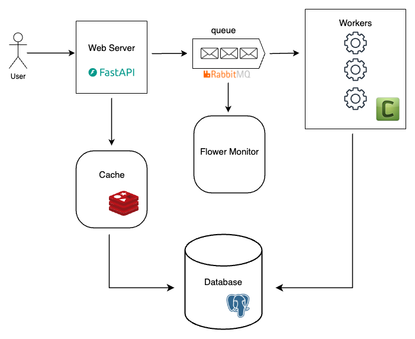
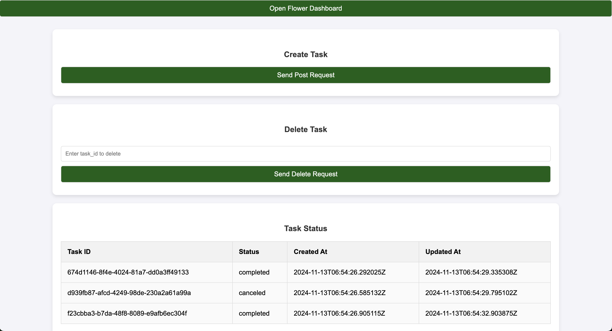

# Architecture

# UI

# How to start the services
1. `docker-compose build --no-cahce`
2. `docker-compose up`
3. `open http://localhost:8000`

# flower monitor
1. `open http://localhost:5555`

# UnitTest
1. `docker-compose exec web bash -c 'pytest backend/tests/tests_views.py --disable-warnings'`

# Linter and Formatter
1. `docker-compose exec web bash -c 'ruff check backend --config backend/pyproject.toml'`
2. `docker-compose exec web bash -c 'isort backend --settings backend/pyproject.toml'`
3. `docker-compose exec web bash -c 'ruff format backend --config backend/pyproject.toml'`

# Migration
1. `docker-compose exec web bash -c 'cd backend && alembic revision --autogenerate -m "xxxxxxx"'`
2. `docker-compose exec web bash -c 'cd backend && alembic upgrade head'`
